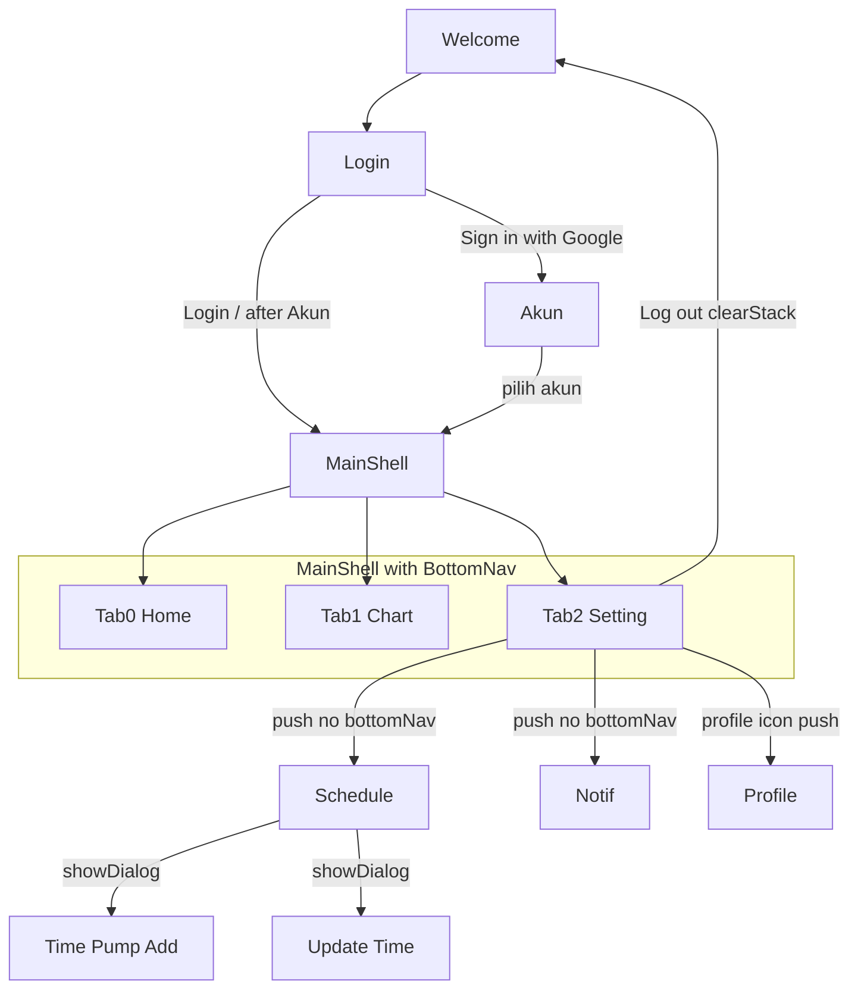

# Flutter UI-Only Parallel Development Plan

Repo saat ini **kosong**. Scope: **UI only** (mock data, no API/Firebase/Google Sign-In SDK).

## Tooling: FVM (wajib)

Laptop ini memakai **FVM 4.1.0**. Versi lokal yang sudah terpasang: `3.22.2`, `3.35.5`.

**Pin project ke Flutter `3.35.5`** (sudah ada di cache FVM; selaras project sibling yang lebih baru).

Di foundation, sebelum scaffold:

```bash
cd /Users/yudham2/Development/Kerja-Jogja/smart-hydroponic
fvm use 3.35.5
fvm flutter create . --project-name smart_hydroponic --org com.kerjajogja
fvm flutter pub get
```

Aturan kerja:

- Semua perintah Flutter lewat **`fvm flutter`** / **`fvm dart`** (bukan `flutter` global).
- Commit `.fvmrc` (+ `.fvm/fvm_config.json` jika digenerate). Ignore `.fvm/flutter_sdk` di `.gitignore`.
- Tiap worktree: jalankan `fvm install` (atau `fvm use`) sekali agar SDK link ada di folder itu.
- Run app: `fvm flutter run`
- VS Code / Cursor: pakai Flutter SDK path dari FVM (`.fvm/flutter_sdk`) agar analyzer sama di semua window.

## Navigation architecture (Flutter best practice)

Pisahkan **auth stack** (tanpa bottom nav) dari **MainShell** (dengan bottom nav). Home **bukan** route lepas — Home adalah **tab index 0** di dalam shell.

```text
Auth stack (tanpa bottom nav)
  Welcome → Login → Akun (dialog di atas Login)

MainShell (Scaffold + BottomNavigationBar + IndexedStack)
  ├─ Tab 0: HomeScreen
  ├─ Tab 1: ChartScreen
  └─ Tab 2: SettingScreen
        └─ Navigator.push (full-screen, bottom nav HIDDEN):
              Schedule | Notif | Profile
              └─ showDialog: Time Pump (Add) | Update Time
```

Aturan:

- Login / pilih akun Google → `pushReplacement` (atau clear stack) ke `MainShell` dengan tab Home aktif. Back dari Home **tidak** kembali ke Login.
- Logout → clear stack ke Welcome.
- Sub-page (Schedule, Notif, Profile) punya back arrow; **jangan** tampilkan bottom nav.
- Time Pump & Update Time = `showDialog`, bukan route/tab baru.
- Pakai `IndexedStack` agar state tiap tab (toggle pump, scroll Chart) tetap hidup saat pindah tab.



## Screen map (1–11)

| # | Name | Layer |
|---|------|--------|
| 1 | Welcome | Auth stack |
| 2 | Login | Auth stack |
| 3 | Akun | Dialog di atas Login |
| 4 | Home | **MainShell tab 0** |
| 5 | Chart | MainShell tab 1 |
| 6 | Setting | MainShell tab 2 |
| 7 | Schedule | Pushed dari Setting |
| 8 | Notif | Pushed dari Setting |
| 9 | Profile | Pushed (Setting / profile icon) |
| 10 | Time Pump | Dialog Add Schedule |
| 11 | Update Time | Dialog Update/Delete |

## Tech choices (minimal deps)

- **Flutter via FVM:** `3.35.5` (lihat section Tooling).
- **Packages ekstra: tidak ada**. Chart = `CustomPainter` + mock points.
- Navigation: `Navigator` + named routes (tanpa `go_router`).
- State: `StatefulWidget` + `setState`.
- Auth Google: UI mock (dialog Akun) saja.
- Theme: hijau brand (~`#2ECC71`), background `#F5F7FA`, Material sans-serif (selaras mock).

## Struktur folder target

```
lib/
  main.dart
  app.dart
  theme/app_theme.dart
  theme/app_colors.dart
  routes/app_routes.dart
  shell/
    main_shell.dart      # IndexedStack + BottomNavigationBar (Home|Chart|Setting)
  widgets/               # StatusBanner, MetricCard, AppBackHeader, primary buttons, dll.
  screens/
    welcome/
    login/               # Login + Akun overlay
    home/                # isi tab 0 saja (tanpa Scaffold bottom nav sendiri)
    chart/
    setting/
    schedule/            # list + Time Pump + Update Time dialogs
    notification/
    profile/
  mock/
assets/images/
```

`HomeScreen` / `ChartScreen` / `SettingScreen` **hanya body content** — bottom nav hanya di `MainShell`.

## Parallel vs sequential

### Harus menunggu (sequential gate)

1. **Foundation** — blokir fitur lain sampai merge.
   - `fvm use 3.35.5` + `fvm flutter create` + commit `.fvmrc`
   - assets, `AppTheme` / `AppColors`
   - Shared widgets (card, switch hijau, buttons, back header)
   - **`MainShell` skeleton**: 3 tab placeholder + `BottomNavigationBar` + `IndexedStack`
   - Named routes: `/welcome`, `/login`, `/main` (→ MainShell), plus stubs sub-page

2. **Integration** di akhir — auth `pushReplacement` → `/main`, logout clear stack, wire Setting → sub-pages, pastikan tab aktif highlight benar.

### Bisa parallel (setelah Foundation merge)

| Track | Isi | Independent karena |
|--------|-----|-------------------|
| Auth | Welcome, Login, Akun | Exit ke route `/main`; tidak edit isi tab |
| Main tabs | Body Home, Chart, Setting | Isi slot IndexedStack; mock lokal |
| Settings pages | Notif, Profile | Pushed routes; self-contained |
| Pump schedule | Schedule + 2 dialog | Pushed + dialog; self-contained |

Home **tidak** menunggu Chart/Setting selesai — kembangkan sebagai body tab, pasang di `MainShell` slot 0. Time Pump & Update Time **satu branch** dengan Schedule.

### Saling tunggu di dalam track

- Login ↔ Akun: satu branch (overlay).
- Schedule ↔ dialogs: satu branch.
- Setting list item dulu (stub `push`) → detail screen parallel lalu di-wire.

## Saran branch & worktree (5 branch)

| # | Branch | Worktree | Isi | Depends on |
|---|--------|----------|-----|------------|
| 0 | `main` | `smart-hydroponic` | setelah merge foundation | — |
| 1 | `feature/foundation` | `sh-foundation` | theme, widgets, **MainShell skeleton**, routes, assets | — |
| 2 | `feature/auth-flow` | `sh-auth` | Welcome, Login, Akun → `pushReplacement` MainShell | foundation |
| 3 | `feature/main-tabs` | `sh-main-tabs` | isi tab Home + Chart + Setting hub | foundation |
| 4 | `feature/settings-pages` | `sh-settings` | Notif, Profile (push, no bottom nav) | foundation |
| 5 | `feature/pump-schedule` | `sh-schedule` | Schedule + Add/Update dialogs | foundation |

**Total: 5 feature branch + 5 worktree** (+ repo utama).

```bash
git worktree add ../sh-foundation -b feature/foundation
# setelah foundation merge ke main:
git worktree add ../sh-auth -b feature/auth-flow main
git worktree add ../sh-main-tabs -b feature/main-tabs main
git worktree add ../sh-settings -b feature/settings-pages main
git worktree add ../sh-schedule -b feature/pump-schedule main

# di SETIAP worktree (SDK link lokal):
cd ../sh-auth && fvm use 3.35.5 && fvm flutter pub get
# ulangi untuk sh-main-tabs, sh-settings, sh-schedule
```

Di tiap window Cursor: run / analyze dengan `fvm flutter …`.

```mermaid
gantt
  title Parallel timeline
  dateFormat X
  axisFormat %s
  section Gate
  Foundation_MainShell     :a1, 0, 2
  section Parallel
  Auth_to_MainShell        :a2, 2, 5
  Tab_Home_Chart_Setting   :a3, 2, 5
  Notif_Profile_push       :a4, 3, 5
  Schedule_dialogs         :a5, 3, 5
  section Integrate
  Wire_nav_and_logout      :a6, 5, 6
```



Merge order: **foundation → main-tabs → auth → settings-pages + pump-schedule (parallel) → polish**.

## Deliverables per branch

**foundation**
- FVM pin `3.35.5` (`.fvmrc`), `.gitignore` FVM SDK symlink
- Theme, shared widgets, assets placeholders
- `MainShell`: `IndexedStack` 3 placeholder + bottom nav labels Home|Chart|Setting
- Routes: auth + `/main` + stub sub-pages

**auth-flow**
- Welcome, Login (eye toggle, Google button), Akun modal mock
- Sukses login / pilih akun → `pushReplacementNamed('/main')` (tab 0 Home)
- Logout dari Setting (wire di integrate) → Welcome + clear stack

**main-tabs**
- **Home (tab 0):** status banner, metric cards, pump switches, system status
- **Chart (tab 1):** param chips, CustomPainter chart, min/avg/max, history
- **Setting (tab 2):** menu Schedule / Notification / Log out (+ stub `push`)

**settings-pages**
- Notif & Profile full-screen dengan back header (no bottom nav)
- Wire profile icon di header tab → Profile

**pump-schedule**
- Schedule list + toggles + Add Schedule
- Dialogs Time Pump (Cancel/Save) & Update Time (Delete/Update)
- Local `setState` list

## Merge & conflict hygiene

- Kontrak file: foundation punya `main_shell.dart` + route stubs; branch parallel hanya isi `screens/<feature>/` + minimal wire di Setting stubs.
- Jangan duplikasi `BottomNavigationBar` di dalam `HomeScreen`.
- Integration check: setelah login land di **tab Home**; di tab Setting highlight **Setting** (bukan Home); sub-page tidak menampilkan bottom nav.

## Out of scope

- Firebase / real Google Sign-In / MQTT / REST
- Persistent storage, push notification real
- `go_router`, chart package, state-management package
